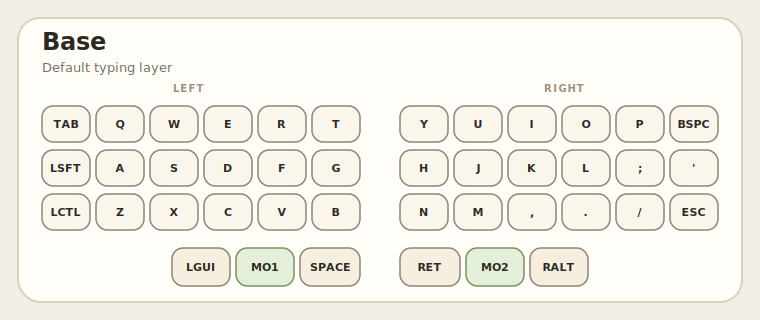
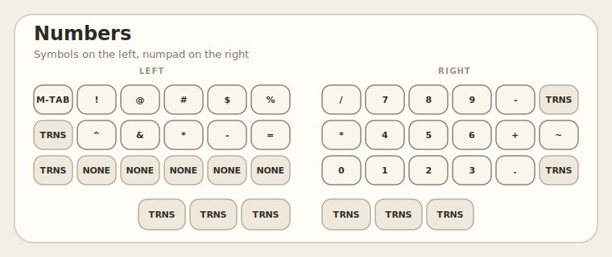
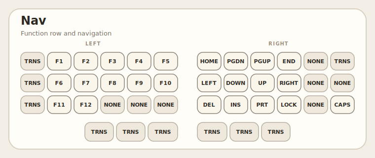
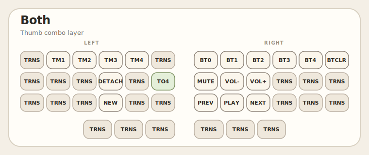
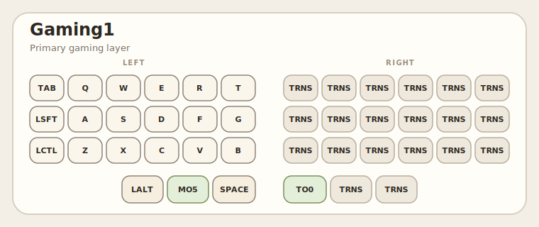
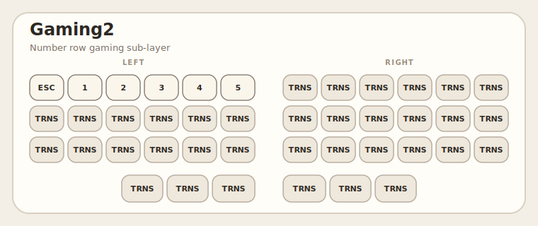

# ZMK Config

Personal ZMK firmware config for a split Corne (`crkbd`) built for `nice_nano_v2`.

## Keymaps

### Base



### Numbers



### Nav



### Both



### Gaming1



### Gaming2



This repo currently builds firmware for:

- `nice_nano_v2` + `corne_left`
- `nice_nano_v2` + `corne_right`

The layout is a 3x6+3 Corne with six layers:

- `Base`: main typing layer
- `Numbers`: symbols on the left, numpad on the right
- `Nav`: function keys on the left, navigation/editing on the right
- `Both`: tmux macros, Bluetooth selection, and media controls
- `Gaming1`: left-hand gaming layer
- `Gaming2`: number row gaming sub-layer

## Layer Access

- Hold left thumb `MO1` to access `Numbers`
- Hold right thumb `MO2` to access `Nav`
- Press both inner thumb keys together to activate `Both`
- From `Both`, `TO4` switches into `Gaming1`
- In `Gaming1`, hold `MO5` to access `Gaming2`
- In `Gaming1`, `TO0` returns to the base layer

## Combos

The keymap defines these combos:

- `R+E` -> `(`
- `U+I` -> `)`
- `F+D` -> `[`
- `K+L` -> `]`
- `V+C` -> `{`
- `M+,` -> `}`
- `R+T` -> `<`
- `U+Y` -> `>`
- `R+U` -> `+`
- `F+K` -> `=`
- `V+M` -> `-`
- `B+N` -> `_`
- Both inner thumb keys -> layer `Both`

## Macros

The `Both` layer includes tmux helpers:

- `tmux1` to `tmux4`: `Ctrl+A`, then window `1` to `4`
- `tmux_new`: `Ctrl+A`, then `c`
- `tmux_detach`: `Ctrl+A`, then `d`

## Build

GitHub Actions uses [`build.yaml`](build.yaml) to build both halves. To build locally with the standard ZMK workflow:

```sh
west build -s zmk/app -b nice_nano_v2 -- -DSHIELD=corne_left
west build -s zmk/app -b nice_nano_v2 -- -DSHIELD=corne_right
```

## Notes

- OLED and RGB underglow support are present in [`config/corne.conf`](config/corne.conf) but currently commented out.
- The keymap lives in [`config/corne.keymap`](config/corne.keymap).
